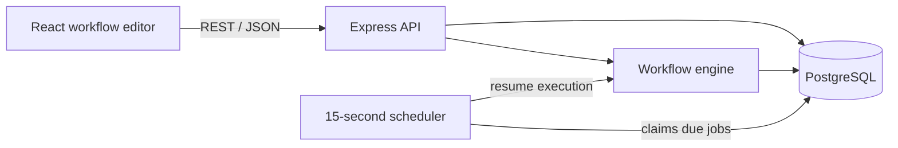

# Workflow Builder

A drag-and-drop workflow editor and execution engine for building, publishing, and auditing automated processes.

The project is domain-independent: a workflow runs against an `entityType`, an `entityId`, and a free-form JSON context. The same engine can model admissions journeys, order processing, ticket escalation, lead qualification, and similar processes.

**Live demo:** [workflow-builder-git-main-ack13s-projects.vercel.app](https://workflow-builder-git-main-ack13s-projects.vercel.app/)  
**Repository:** [github.com/ack13/workflow-builder](https://github.com/ack13/workflow-builder)

## Highlights

- Visual workflow editor powered by React Flow
- Draft and published workflow states
- Manual execution with editable JSON test context
- Branching using context fields and `yes`/`no` paths
- Durable PostgreSQL-backed delays
- Atomic scheduled-job claiming for multiple workers
- Scheduler retries, failure tracking, and resume timestamps
- Execution history with node-level audit logs
- Publish-time graph validation
- Case-insensitive unique workflow names
- Mocked email and entity-status integration boundaries

## Architecture



| Layer | Technology | Responsibility |
| --- | --- | --- |
| Frontend | React, Vite, React Flow | Canvas, node configuration, publishing, manual runs, and execution history |
| Backend | Node.js, Express, TypeScript | REST API, validation, graph interpretation, and scheduling |
| Database | PostgreSQL | Workflow graphs, executions, audit logs, and scheduled jobs |

## Workflow steps

| Step | Behavior |
| --- | --- |
| **Manual Trigger** | Starts the latest published graph from the Run button |
| **Delay** | Parks an execution until a calculated resume time |
| **Branch** | Evaluates a field from execution context and selects the `yes` or `no` path |
| **Send email (mock)** | Resolves templates and records an email audit event without delivering a real message |
| **Set Status** | Updates execution context through a mocked entity adapter |
| **Go To Action** | Jumps to a configured step; cyclic graphs are rejected during publishing |
| **Goal** | Marks the execution as successfully completed |

## Execution lifecycle

1. The user edits and saves `draft_graph`.
2. Publish validation checks the graph and copies it to `published_graph`.
3. A manual run creates an `executions` row and begins at the Trigger.
4. The engine dispatches each node to its corresponding handler.
5. A Delay creates a `scheduled_jobs` row and changes the execution to `waiting`.
6. The scheduler polls every 15 seconds and atomically claims due jobs using `FOR UPDATE SKIP LOCKED`.
7. Successful jobs resume at the step after Delay. Failed jobs retry up to three times.
8. Node visits, branch decisions, scheduler failures, and mocked emails appear in execution history.

```text
running → waiting → running → completed
    └────────────────────────→ failed
```

## Publish validation

Before a workflow can be published, the backend checks:

- Exactly one Manual Trigger exists
- The Trigger has an outgoing connection
- Required node fields are configured
- Every node is reachable from the Trigger
- Branch nodes have exactly one `yes` and one `no` path
- Go To nodes reference an existing target
- Mock email nodes contain a recipient and subject
- Connections reference existing nodes
- The graph contains no unsafe cycles

Validation is enforced on the backend rather than relying only on the UI.

## Delay scheduling

Delay nodes do not keep an HTTP request or JavaScript timer open for the duration of the wait. They persist an alarm in PostgreSQL:

```text
Delay reached
  → scheduled_jobs(status=pending, run_at=...)
  → execution(status=waiting)
  → scheduler claims job when run_at <= now()
  → engine resumes execution
```

Job claims are stored in the database, allowing multiple persistent backend workers to poll without processing the same job concurrently. Claims abandoned by a crashed worker become available again after a timeout.

The worker uses a 15-second polling interval, so a job may resume up to approximately 15 seconds after its requested time.

> The scheduler requires a continuously running backend process. A short-lived serverless function is not suitable for the current `setInterval` worker.

## Example workflow

```text
Manual Trigger
      ↓
Set Status: application_received
      ↓
Send acknowledgement email (mock)
      ↓
Delay: 10 seconds
      ↓
Branch: application.score > 79
   yes ↙                 ↘ no
Shortlisted          Manual review
      ↓                  ↓
   Go To ─────────→ Shared update email
                         ↓
                       Goal
```

Test context:

```json
{
  "application": {
    "score": 88
  },
  "contact": {
    "email": "student@example.com"
  }
}
```

## Project structure

```text
workflow-builder/
├── frontend/
│   └── src/
│       ├── components/       # Canvas, palette, inspector, history, workflow list
│       ├── nodeTypes/        # Node definitions and shared node renderer
│       ├── api.js            # Backend API client
│       └── styles.css
├── backend/
│   └── src/
│       ├── db/               # Schema, migrations, pool, and data access
│       ├── engine/           # Interpreter, graph validation, scheduler, handlers
│       ├── routes/           # Express workflow and execution endpoints
│       ├── services/         # Mock email and entity adapters
│       └── index.ts
└── README.md
```

## Local setup

### Prerequisites

- Node.js 20+
- PostgreSQL 14+
- `psql` available on your command line

### 1. Create the database

```bash
createdb workflow_builder
psql workflow_builder -f backend/src/db/schema.sql
```

### 2. Start the backend

```bash
cd backend
npm install
DATABASE_URL=postgres://localhost:5432/workflow_builder npm run dev
```

The API runs at `http://localhost:4000`.

For an existing database created with an earlier schema, apply the included migrations:

```bash
cd backend
DATABASE_URL=postgres://localhost:5432/workflow_builder npm run db:migrate:delay
DATABASE_URL=postgres://localhost:5432/workflow_builder npm run db:migrate:names
```

### 3. Start the frontend

```bash
cd frontend
npm install
npm run dev
```

The editor runs at `http://localhost:5173` and defaults to `http://localhost:4000/api`.

To use another backend:

```bash
VITE_API_URL=https://your-api.example.com/api npm run dev
```

## Useful commands

```bash
# Backend
cd backend
npm run dev
npm run build
npm start

# Frontend
cd frontend
npm run dev
npm run build
npm run preview
```

## API overview

| Method | Endpoint | Purpose |
| --- | --- | --- |
| `GET` | `/api/workflows` | List workflows |
| `POST` | `/api/workflows` | Create a uniquely named workflow |
| `GET` | `/api/workflows/:id` | Load a workflow and its graphs |
| `PUT` | `/api/workflows/:id/draft` | Save the editable graph |
| `PUT` | `/api/workflows/:id/name` | Rename a workflow |
| `POST` | `/api/workflows/:id/publish` | Validate and publish the draft |
| `POST` | `/api/workflows/:id/run` | Manually execute the published graph |
| `GET` | `/api/workflows/:id/executions` | List recent executions |
| `GET` | `/api/executions/:id` | Read current execution state |
| `GET` | `/api/executions/:id/history` | Read node logs and scheduled jobs |

Manual-run request example:

```bash
curl -X POST http://localhost:4000/api/workflows/WORKFLOW_ID/run \
  -H 'Content-Type: application/json' \
  -d '{
    "entityType": "application",
    "entityId": "APP-1001",
    "context": {
      "application": { "score": 88 },
      "contact": { "email": "student@example.com" }
    }
  }'
```

## Data model

- `workflows` stores the editable and published graphs as JSONB.
- `executions` stores one workflow run, its context, state, and current node.
- `execution_logs` provides the node-level audit trail.
- `scheduled_jobs` stores durable delay alarms, claims, attempts, and errors.

Storing the graph as JSONB keeps editing and execution simple. Normalized node and edge tables would become useful if cross-workflow reporting were a primary requirement.

## Intentional limitations

This repository is an interview-oriented prototype, not a production automation service.

- **Manual trigger only:** event, webhook, and schedule triggers are not yet exposed.
- **Mock email:** no external email is delivered. The adapter returns a mock ID and writes an audit event.
- **Mock entity update:** Set Status updates execution context but is not connected to a domain database.
- **No authentication or authorization:** the API must be protected before handling real user data.
- **No guarded cycles:** cyclic workflows are rejected until iteration limits, exit conditions, and idempotency are supported.
- **Version pinning needs strengthening:** a future `workflow_versions` table should ensure long-running executions always resume against the exact graph version with which they started.
- **Scheduler hosting:** the current worker needs a persistent Node.js service.

## Production roadmap

1. Immutable workflow-version records referenced by executions
2. Authentication, ownership, and authorization
3. Real email and domain-entity adapters with idempotency keys
4. Webhook, event, and scheduled triggers
5. A dedicated worker process or durable queue such as pg-boss/BullMQ
6. Execution cancellation, retry controls, and dead-letter handling
7. Guarded loops with explicit limits and exit conditions
8. Automated unit and integration tests
9. Executed-path highlighting on the canvas

## Design principles

- Keep the engine independent of domain-specific entities.
- Execute only published graphs, never unsaved editor state.
- Persist waits instead of keeping application threads open.
- Validate server-side before publishing.
- Keep external side effects behind replaceable adapters.
- Record enough history to explain what happened during every run.

## License

This project is currently provided as a portfolio and interview demonstration. Add a license before using or distributing it as an open-source project.
